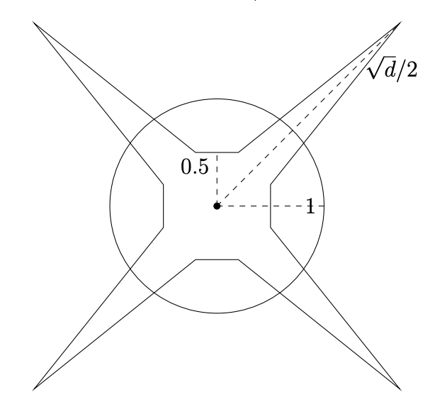

# DAS-PINNs:  A deep adaptive sampling method for solving high-dimensional partial differential equations


TensorFlow implementation for 
[DAS-PINNs: A deep adaptive sampling method for solving high-dimensional partial differential equations](https://arxiv.org/abs/2112.14038).


# Requirements

TensorFlow >= 2.0

TensorFlow Probability


# Motivation

Physics-informed neural networks are a type of promising tools to tackle high-dimensional partial differential equations.

To train a physics-informed neural network, one needs to sample data points in the computational domain. 
In general, data points are randomly generated by a uniform distribution (or other quasi-random methods based on uniform samples) on the computational domain. 

For higher-dimensional cases, the sparsity of high-dimensional data will induce some severe difficulties. 
Adaptive sampling strategies are crucial for developing more efficient and reliable deep learning techniques for the approximation of PDEs.

Most of the volume of a high-dimensional cube is located around its corner  ===>   Choosing uniform samples is not a good choice for high-dimensional problems




### An adaptive sampling method for solving PDEs using PINNs

The residual in PINNs is treated as a probability density function (up to a constant) and can be approximated with a deep generative model (KRnet). The new samples from KRnet are consistent with the distribution induced by the residual, i.e., more samples are located in the region of large residual and less samples are located in the region of small residual. Analogous to classical adaptive methods such as the adaptive finite element, KRnet acts as an error indicator that guides the refinement of the training set. Compared to the neural network approximation obtained with uniformly distributed collocation points, the developed algorithms can significantly improve the accuracy, especially for low regularity and high-dimensional problems. 


# Train
```bash
python das_train.py
```


# Citation
If you find this repo useful for your research, please consider to cite our paper
```
@article{tangdas,
  title={D{AS-PINN}s: {A} deep adaptive sampling method for solving high-dimensional partial differential equations},
  author={Tang, Kejun and Wan, Xiaoliang and Yang, Chao},
  journal={Journal of Computational Physics},
  volume={476},
  pages={111868},
  year={2022},
  publisher={Elsevier}
}
```


