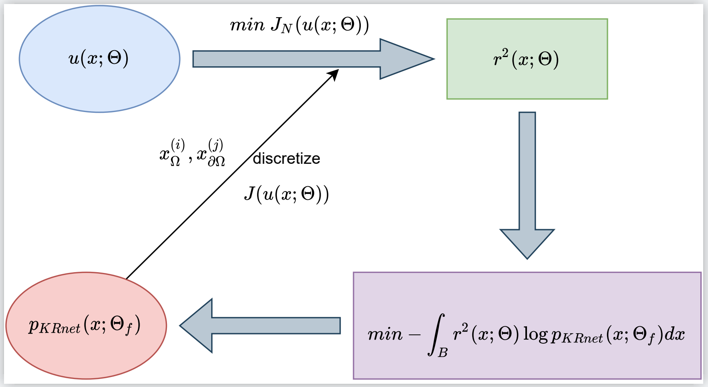

# DAS-PINNs:  A deep adaptive sampling method for solving partial differential equations


TensorFlow implementation for [DAS-PINNs:  A deep adaptive sampling method for solving partial differential equations] (https://arxiv.org/abs/2112.14038).

An adaptive sampling method for solving PDEs using PINNs. The residual in PINNs is treated as a probability density function and can be approximated with a deep generative model (KRnet). The new samples from KRnet are consistent with the distribution induced by the residual, i.e., more samples are located in the region of large residual and less samples are located in the region of small residual. Analogous to classical adaptive methods such as the adaptive finite element, KRnet acts as an error indicator that guides the refinement of the training set. Compared to the neural network approximation obtained with uniformly distributed collocation points, the developed algorithms can significantly improve the accuracy, especially for low regularity and high-dimensional problems. 




# Requirements

TensorFlow >= 2.0

TensorFlow Probability


# Simple Train with 1 GPU
```bash
python das_train.py
```


